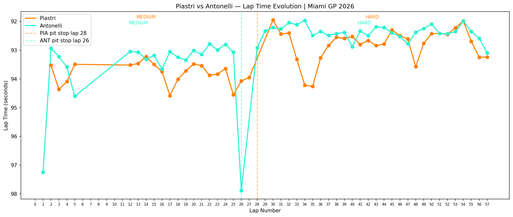

# fastf1-analysis

> 🏎 A learning project — documenting my path towards F1 software engineering.  
> Real race data analysis using FastF1, pandas and matplotlib.

---

## What this is

This project is part of my self-directed learning towards becoming a software engineer in Formula 1. I'm using real telemetry data from the official F1 API (via FastF1) to understand how teams analyze race strategy, tyre degradation and driver performance.

Each script represents a new concept I've learned. The project grows with every session.

---

## Current analysis

### Lap time evolution + pit stop strategy
Compare two drivers lap-by-lap, with automatic pit stop detection, tyre compound labels and interactive tooltips.



**What you can read from this chart:**
- Antonelli pitted on lap 26, Piastri on lap 28 — Antonelli attempted an undercut
- Both drivers ran Medium → Hard strategy
- McLaren showed stronger pace throughout, especially in Stint 1

---

## Roadmap

- [x] Lap time evolution with tyre compound
- [x] Pit stop detection and visualization
- [x] Interactive tooltips (lap number + exact time)
- [ ] Speed trace — sector by sector telemetry comparison
- [ ] Tyre degradation model (regression per compound)
- [ ] Undercut detector — automated strategy analysis
- [ ] Multi-driver comparison (full grid)

---

## Stack

- Python 3.11
- [FastF1](https://github.com/theOehrly/Fast-F1) — F1 telemetry and timing data
- pandas — data manipulation
- matplotlib — visualization
- mplcursors — interactive tooltips

---

## Setup

```bash
# Clone the repo
git clone https://github.com/yuna-espejo/fastf1-analysis.git
cd fastf1-analysis

# Install dependencies
pip install fastf1 matplotlib pandas mplcursors

# Run
python miami2026.py
```

> The `cache_f1/` folder is created automatically on first run. FastF1 downloads and caches the session data locally so subsequent runs are instant.

---

## About

I'm Yuna — Junior Consultant at Timestamp Group, starting Computer Science at UOC in September 2026.  
My goal is to work as a software engineer at an F1 team.  
This project is one step in that direction.

[Portfolio](https://yunaespejo.com) · [LinkedIn](https://linkedin.com/in/yunaespejo)